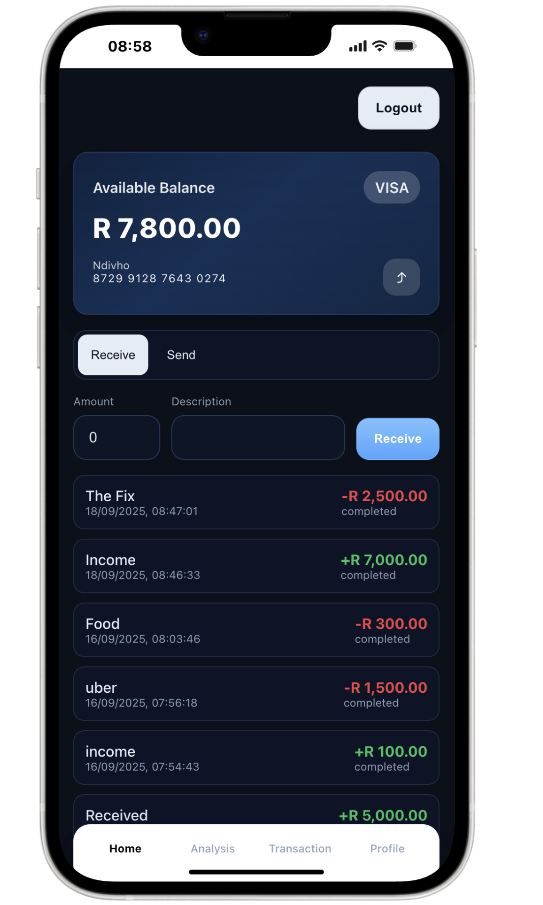

````markdown
# 💳 SimpleBank  

Welcome to **SimpleBank** — your **minimalist expense tracker** built with  
⚡ **React (Vite)** · 🛠 **Node.js / Express** · 🗄 **MongoDB**  

Track your spending. Stay in control. Keep it simple. 🚀  

---

## 🖼 Preview



---

## ✨ Features
- 🔐 **Authentication** – Secure register & login with JWT  
- 📊 **Expense Tracking** – Add, view, and manage transactions  
- 🌐 **API-First Design** – REST endpoints ready to extend  
- 🎨 **Clean UI** – Simple, distraction-free interface  

---

## 📦 Prerequisites
- Node.js **v18+**  
- MongoDB (local or via `MONGODB_URI`)  

---

## 🖥 Backend Setup

1. Create a `.env` file inside `backend/`:
   ```env
   MONGODB_URI=mongodb://localhost:27017/simplebank
   PORT=5000
   JWT_SECRET=your_super_secret_key
   CORS_ORIGIN=http://localhost:5173
````

2. Run the backend server:

   ```bash
   cd backend
   npm run dev
   ```

3. Health check endpoint:
   👉 `GET http://localhost:5000/health`

---

## 🎨 Frontend Setup

Run the React dev server:

```bash
cd frontend
npm run dev
```

🌍 App will be live at:
`http://localhost:5173`

---

## 🔑 API Overview

### Authentication

* **Register** → `POST /api/auth/register`
  Payload: `{ name, email, password }`

* **Login** → `POST /api/auth/login`
  Returns: `{ token, user }`

### Expenses (requires Bearer token)

* 📜 **List all** → `GET /api/transactions`
* ➕ **Create** → `POST /api/transactions`
  Payload: `{ amount, currency?, description? }`
* 🔎 **Get by ID** → `GET /api/transactions/:id`

---

## 📝 Notes

* In dev mode, the frontend proxies all `/api/*` requests to `http://localhost:5000`.
* Basic CSS utilities live in `frontend/src/index.css`.

---

## 🚀 Future Ideas

* 📈 Charts & analytics for better insights
* 🌍 Multi-currency support
* 📱 Mobile-first responsive design

---


