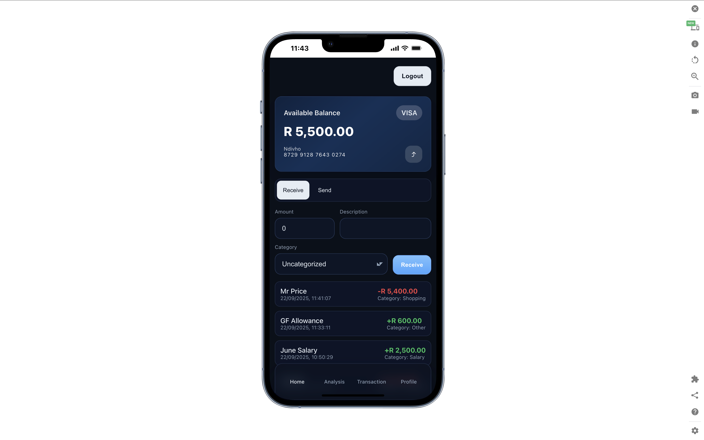

# 💳 SimpleBank

Welcome to **SimpleBank** — a **minimalist expense tracker** designed to help you easily monitor and manage your spending.

Built with:  
⚡ **React (Vite)** · 🛠 **Node.js / Express** · 🗄 **MongoDB**

Track your spending. Stay in control. Keep it simple. 🚀

---

# ✨ Features

- 🔐 **Authentication** – Secure user registration and login using JWT
- 📊 **Expense Tracking** – Add, view, and manage financial transactions
- 🌐 **API-First Design** – RESTful API architecture that is easy to extend
- 🎨 **Clean UI** – Simple and distraction-free interface

---

# 📦 Prerequisites

Before running the project, ensure you have the following installed:

- **Node.js v18+**
- **MongoDB** (local installation or via `MONGODB_URI`)

---

# 🖥 Backend Setup

### 1. Create an Environment File

Inside the `backend/` folder, create a `.env` file:

```env
MONGODB_URI=mongodb://localhost:27017/simplebank
PORT=5000
JWT_SECRET=your_super_secret_key
CORS_ORIGIN=http://localhost:5173
````

### 2. Install Dependencies and Start the Server

```bash
cd backend
npm install
npm run dev
```

### 3. Health Check Endpoint

You can verify that the backend is running by visiting:

```
GET http://localhost:5000/health
```

---

# 🎨 Frontend Setup

Run the React development server:

```bash
cd frontend
npm install
npm run dev
```

🌍 The application will be available at:

```
http://localhost:5173
```

---

# 🖼 Preview



---

# 🔑 API Overview

## Authentication

**Register**

```
POST /api/auth/register
```

Payload:

```json
{
  "name": "string",
  "email": "string",
  "password": "string"
}
```

---

**Login**

```
POST /api/auth/login
```

Response:

```json
{
  "token": "JWT_TOKEN",
  "user": {}
}
```

---

## Transactions (Requires Bearer Token)

**List Transactions**

```
GET /api/transactions
```

---

**Create Transaction**

```
POST /api/transactions
```

Payload:

```json
{
  "amount": "number",
  "currency": "optional",
  "description": "optional"
}
```

---

**Get Transaction by ID**

```
GET /api/transactions/:id
```

---

# 📝 Notes

* In development mode, the frontend proxies all `/api/*` requests to `http://localhost:5000`.
* Basic CSS utilities are located in:

```
frontend/src/index.css
```

---

# 🚀 Future Improvements

* 📈 Transaction charts and spending analytics
* 🌍 Multi-currency support
* 📱 Fully responsive mobile-first design
* 🔔 Notifications and budget alerts

---
